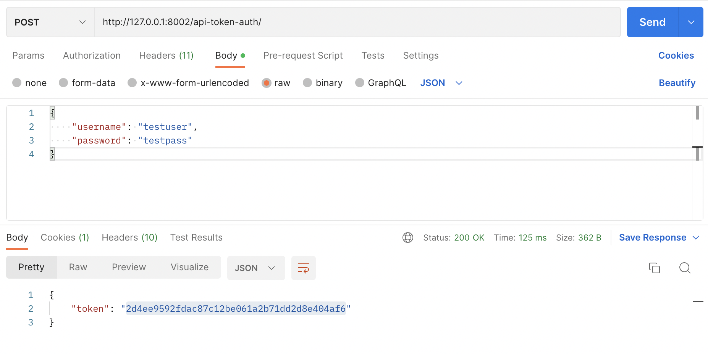
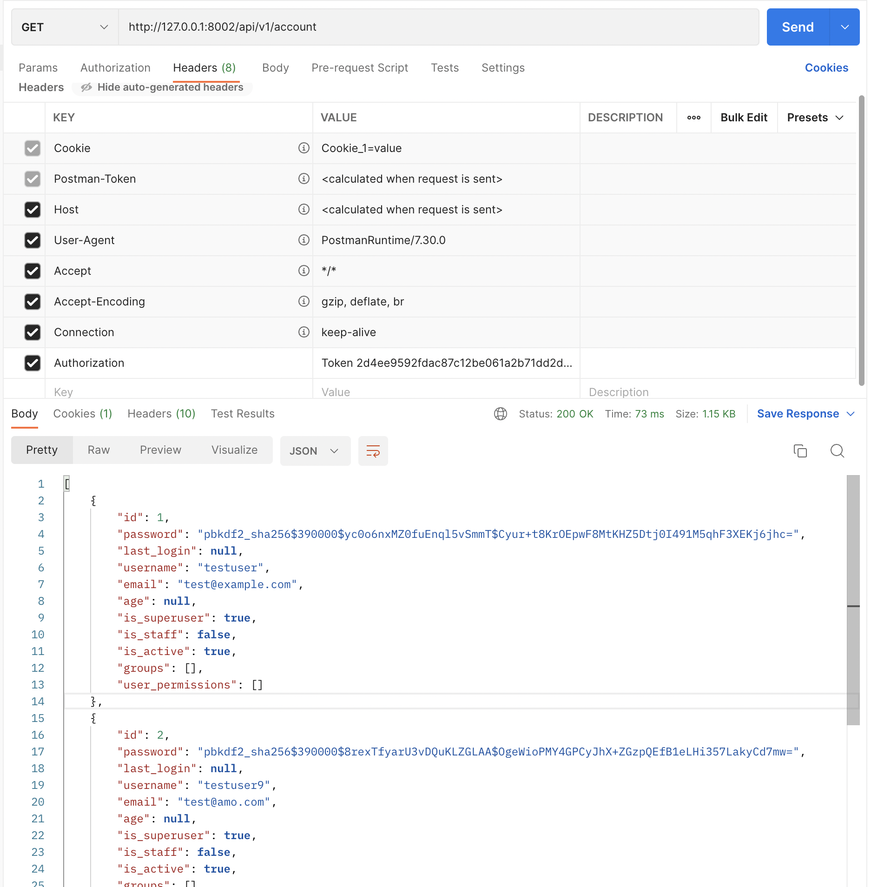

# Django REST Framework の認証について

## 概要

DRF の認証方法を紹介します。

## 実行

Docker を実行できる環境下で実行します。
以下のコマンドを実行します。

```
docker-compose up --build
```

## 確認

### Basic Authenticatiion

ブラウザで`http://127.0.0.1:8001/api/v1/`にアクセスすると、Basic 認証がかかっていることを確認できます。

### Token Authentication

1. スーパーユーザーを作成します
2. `http://127.0.0.1:8002/api-token-auth/`に 1.で作成したユーザーのユーザー名とパスワードをリクエストボディに含め、POST リクエストを実行します

   

3. 2.で得たトークンをリクエストヘッダーに設定し、`http://127.0.0.1:8002/api/v1/account/`へ GET リクエストを実行します

   
