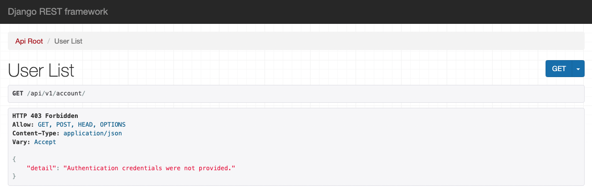
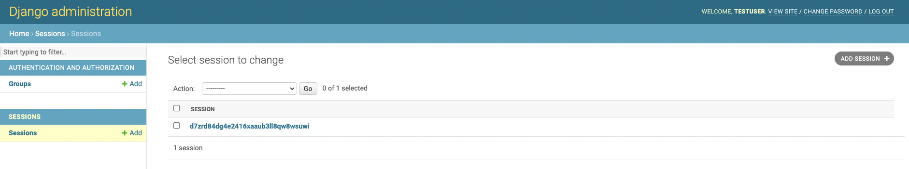
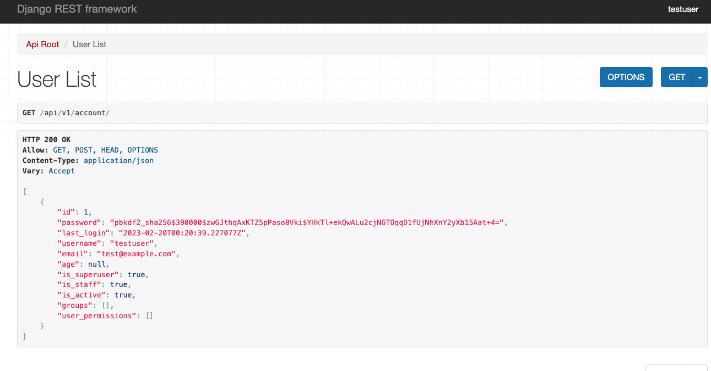

# Django REST Framework の認証について

## 概要

DRF の認証方法を紹介します。

## 各種バージョン

- Python: 3.10.3
- Django: 4.1.4
- djangorestframework: 3.14.0
- Docker: 20.10.11
- docker-compose: 2.2.1

## 実行

Docker を実行できる環境下で実行します。
以下のコマンドを実行します。

```
docker-compose up --build
```

## 確認

### Basic Authenticatiion

ブラウザで`http://127.0.0.1:8001/api/v1/`にアクセスすると、Basic 認証がかかっていることを確認できます。

### Token Authentication

1. スーパーユーザーを作成します
2. `http://127.0.0.1:8002/api-token-auth/`に 1.で作成したユーザーのユーザー名とパスワードをリクエストボディに含め、POST リクエストを実行します

   

3. 2.で得たトークンをリクエストヘッダーに設定し、`http://127.0.0.1:8002/api/v1/account/`へ GET リクエストを実行します

   

### Session Authentication

1. スーパーユーザーを作成します
2. ブラウザで`http://127.0.0.1:8003/api/v1/account`にアクセスすると、`Authentication credentials were not provided.`のエラーが発生します

   

3. `http://127.0.0.1:8003/api/v1/admin`にアクセスし、1.で作成したユーザー情報でログインします。(セッション作成)

   

4. 再度`http://127.0.0.1:8003/api/v1/account`にアクセスすると、1.で作成したユーザー情報が取得できるようになります。

   
